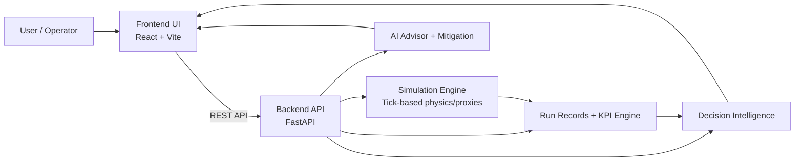
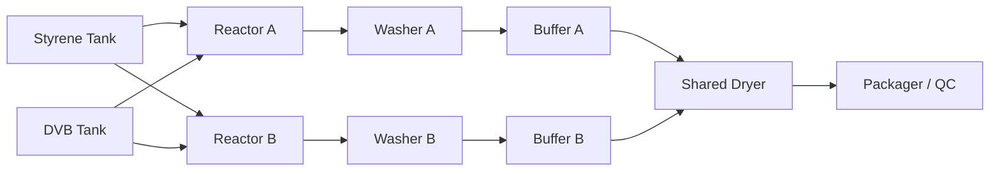
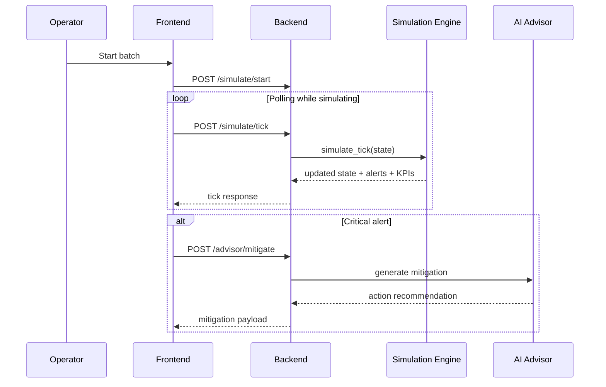
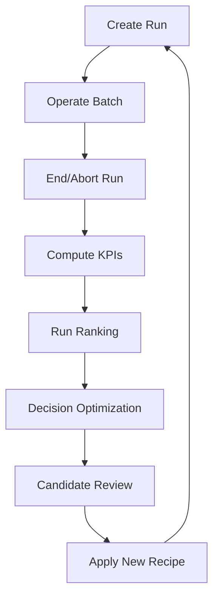

# Ion Exchange Resin Simulator
## System Documentation and User Manual

Version: 1.0  
Audience: New operators, engineers, demo users, and developers

---

## 1) What This Software Is

The Ion Exchange Resin Simulator is a digital-twin style process simulator for an ion-exchange resin manufacturing line. It combines:

- A visual plant model (React frontend)
- A simulation engine (FastAPI backend)
- AI-assisted operations support (advisor + mitigation suggestions)
- Run evidence tracking and decision-intelligence features

Primary goal: let users run batches, monitor plant behavior, inspect alerts, compare runs, and explore optimized recipe recommendations.

---

## 2) High-Level System Architecture

Notes:
- Frontend is the interaction layer.
- Backend is state authority and process logic host.
- Decision intelligence uses run evidence and generated KPI proxies for recommendations.

---

## 3) Current Runtime Configuration

From current setup:

- Frontend API target: `frontend/.env.local` -> `VITE_API_URL=http://localhost:8004`
- Backend (active expected): `http://localhost:8004`
- Frontend dev URL (expected): `http://localhost:5174` (may shift if port is occupied)

---

## 4) Quick Start for a New User (Operator Flow)

1. Open the app in browser (typically `http://localhost:5174`).
2. Check top bar:
   - `Operational/Idle` status
   - `Backend Offline` badge (must NOT show for normal use)
3. Go to **Plant Twin (Designer)** view.
4. Click **Initiate Batch** in header.
5. Monitor:
   - Reactor temperature
   - Conversion
   - Alerts
   - Inventory drawdown
6. If critical alert occurs:
   - Simulation auto-pauses
   - Chat opens with AI mitigation guidance
7. Use **Runs & Evidence** to start/end runs and collect KPI evidence.
8. Use **Decision Intelligence** to rank runs and generate next recipe options.

---

## 5) Navigation Map (UI Sections)

Sidebar sections:

- **Monitoring**
  - `Live Dashboard`
  - `Plant Twin (Designer)`
- **Operations**
  - `Production Logs`
  - `Alert Matrix`
  - `Inventory Pulse`
  - `AI Advisor`
  - `Runs & Evidence`
  - `Decision Intelligence`
- **System Console**
  - `Asset Engineering` (Node Factory)
  - `Plant Configuration`

---

## 6) Plant Model and Process Topology

### 6.1 Default Process Topology

### 6.2 Lines

- Line A: Bulk cation synthesis path
- Line B: Precision anion synthesis path
- Shared downstream: dryer and packaging

### 6.3 Major Material Classes

- Raw: Styrene, DVB, sulfuric acid, caustic soda
- WIP: copolymer beads, washed beads
- Finished: cation resin, anion resin

---

## 7) Simulation Engine Behavior (What Happens Per Tick)

Each tick updates state in this order:

1. Batch stage progression
2. Node-by-node process logic
3. Alerts and safety checks
4. Throughput and inventory movements
5. Energy/cost accumulation
6. Bottleneck heuristics
7. History point creation

### 7.1 Core Process Mechanics Included

- Sigmoidal conversion behavior
- Exothermic thermal rise and jacket cooling
- Agitation power proxy
- Quality outputs (e.g., PSD, WBC, ion capacity) via proxies
- Stage-based process transitions
- Automatic trip/alert thresholds

### 7.2 Safety Interlock

- If a critical error alert is emitted:
  - frontend auto-pauses simulation
  - chat panel opens
  - mitigation action request is sent to advisor endpoint

---

## 8) Data and Control Flow

---

## 9) Dashboard and Operational Modules (Detailed)

### 9.1 Live Dashboard

Use for at-a-glance operations status:

- Stage progression
- Tick/time position
- Core node health indicators
- Recipe snapshot indicators

### 9.2 Plant Twin (Designer)

Main operation canvas:

- Left sidebar: control settings, actions, factory access
- Center: node-link process canvas
- Right sidebar: analytics/diagnostics

Use this view for:
- watching flow transitions
- observing state changes per equipment unit
- interactive topology edits (when not simulating)

### 9.3 Logs and Alert Matrix

- Logs: chronological operational events
- Alerts: warning/error audit with node association

Recommended use:
- validate if process drift corresponds with recent control/input changes
- identify repeated risk patterns

### 9.4 Inventory Pulse

Tracks:
- current stock
- capacity
- reorder risk
- category buckets (raw/WIP/finished)

### 9.5 AI Advisor

Use for:
- operational Q&A
- context-aware recommendations
- mitigation proposals tied to alert signals

### 9.6 Runs & Evidence

Run lifecycle:

1. `Start` run
2. execute process
3. `End` (or `Abort`) run
4. system computes KPIs and stores run evidence

Supports:
- listing runs
- run detail retrieval
- run comparison
- run export
- bulk deletion (with active-run guardrails)

### 9.7 Decision Intelligence

Capabilities:

- rank completed/aborted runs
- optimize next recipe candidates under constraints
- recommend next balanced recipe
- explain a run-specific best candidate with trace

Output includes:
- ranked candidates
- predicted KPI proxies
- score/confidence
- explainability trace (signals, causes, impacts, tradeoffs)

---

## 10) Run and Decision Workflow (Recommended)

This loop is your continuous-improvement cycle.

---

## 11) API Reference (Operationally Important Endpoints)

### 11.1 Health and State

- `GET /` -> service health + current tick
- `GET /ping` -> liveness
- `GET /state` -> full state snapshot
- `POST /state/update` -> partial state sync
- `POST /state/reset` -> reset plant state

### 11.2 Simulation Control

- `POST /simulate/start`
- `POST /simulate/stop`
- `POST /simulate/tick`
- `POST /simulate/demo-scenario`
- `POST /simulate/mitigate`

### 11.3 Advisor and Mitigation

- `POST /advisor/chat`
- `POST /advisor/mitigate`
- `GET /recommendations`
- `GET /mitigation-log`
- `POST /mitigation-log/apply`

### 11.4 Runs

- `POST /runs/start`
- `POST /runs/{run_id}/end`
- `POST /runs/{run_id}/abort`
- `GET /runs`
- `GET /runs/active`
- `GET /runs/{run_id}`
- `POST /runs/compare`
- `POST /run-actions/bulk-delete`
- `GET /runs/{run_id}/export`

### 11.5 Decision Intelligence

- `GET /decisions/run-ranking`
- `POST /decisions/optimize`
- `GET /decisions/recommend-next`
- `POST /decisions/explain`

---

## 12) New User Operating SOP (Step-by-Step)

### Step A: Pre-check

- Confirm backend online (no “Backend Offline” in header)
- Confirm recipe shown in top bar is expected

### Step B: Controlled Start

- Open `Plant Twin (Designer)`
- Initiate batch
- Observe first 10-20 ticks before applying adjustments

### Step C: Watch Key Signals

- Reactor temperatures and trend direction
- Conversion slope
- Alert generation cadence
- Buffer fill behavior
- Inventory depletion speed

### Step D: Risk Response

- If error: pause, inspect alert matrix, review mitigation
- Use AI Advisor recommendation, then monitor stabilization

### Step E: Evidence Capture

- Start run before meaningful trial
- End/abort run when trial completes
- Compare against prior baseline runs

### Step F: Optimization

- Use Decision Intelligence
- Evaluate top candidate recipe tradeoffs
- Apply conservative changes first, then iterate

---

## 13) Troubleshooting Guide

### Symptom: `Backend Offline` badge

Actions:
1. verify backend process is running
2. verify frontend API URL (`VITE_API_URL`) matches backend port
3. restart frontend after env changes

### Symptom: `404` on decisions endpoints

Cause: backend instance without phase-5 routes (wrong process/port)

Fix:
1. start correct backend from `backend/main.py`
2. verify `GET /openapi.json` includes `/decisions/*`

### Symptom: Browser says CORS blocked

Commonly this is a backend 500 surfaced by browser as CORS-like failure.

Fix:
1. inspect backend logs
2. test endpoint directly via curl/Postman
3. resolve backend exception

### Symptom: Frontend starts on unexpected port

If default port busy, Vite auto-shifts (e.g., `5173` to `5174`).

Use terminal output for the active URL.

---

## 14) Glossary

- **Tick**: one simulation update cycle
- **Batch Stage**: setup/polymerization/functionalization/hydration/complete
- **Mitigation**: corrective action for risk conditions
- **Run**: labeled experiment window with KPI capture
- **KPI**: summarized performance indicators for a run
- **WBC**: water-based capacity proxy metric used in quality heuristics
- **PSD**: particle size distribution indicators

---

## 15) Practical Limitations (Important for New Users)

Current process logic is strong for simulation and guided experimentation, but still uses engineered heuristics/proxies. Treat outputs as decision support for learning and iteration, not as direct replacement for production-grade plant control models without calibration/validation against plant data.

---

## 16) Suggested Onboarding Plan (First 60 Minutes)

1. 0-10 min: open app, understand views, locate status/tick/stage indicators
2. 10-20 min: run one baseline batch, watch alerts and inventory
3. 20-35 min: use Runs & Evidence, capture end-run KPIs
4. 35-50 min: create second run with one recipe adjustment
5. 50-60 min: compare runs and review Decision Intelligence candidates

---

## 17) Developer Notes (For Internal Team)

- Frontend state store: `frontend/src/store/simulationStore.ts`
- Polling and safety interlock: `frontend/src/hooks/useSimulation.ts`
- API client: `frontend/src/services/api.ts`
- Backend entry: `backend/main.py`
- Simulation engine: `backend/simulation.py`
- Run metrics: `backend/run_metrics.py`
- Decision stack: `backend/decision_service.py`, `backend/run_ranker.py`, `backend/recipe_optimizer.py`, `backend/explainability.py`

---

If you want, I can also generate:

1. a **short operator quick-reference card** (1-page)  
2. a **training version** of this manual with exercises  
3. a **developer architecture appendix** with endpoint payload examples

